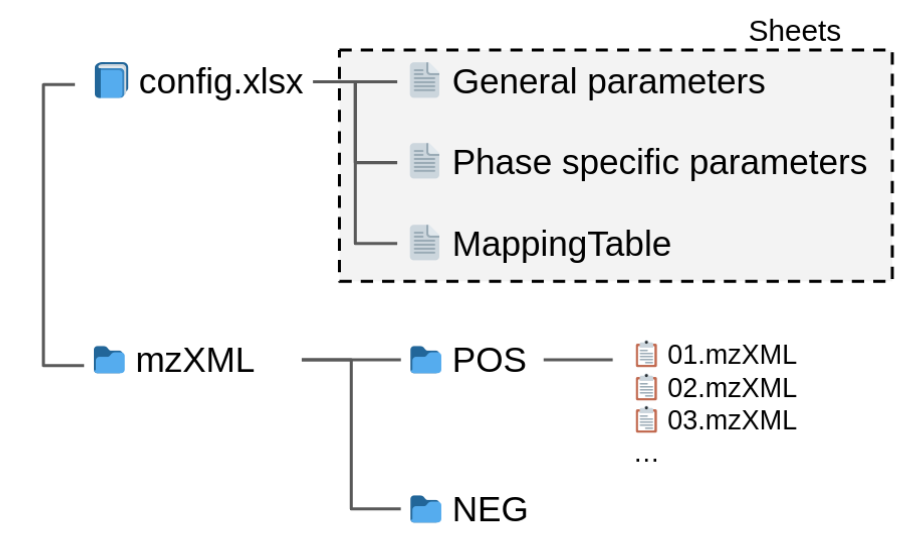

# LC-MS data analysis pipeline

此流程旨在自動化分析質譜儀（mass spectrometry）產生的代謝體（metabolomics）資料。流程主要包含兩個部分：首先，使用 AutoTuner [[3](https://doi.org/10.1021/acs.analchem.9b04804)] 自動選擇 xcms [[1](https://doi.org/10.1021/ac051437y), [2](https://doi.org/10.1186/1471-2105-9-504)] 套件所需的參數，然後使用xcms提取各個資料集中的代謝特徵（Features）。整個流程使用R語言中的drake [[4](https://doi.org/10.1186/1471-2105-9-504)] 套件來構建和管理，該套件具有易於執行和維護的優勢，並能夠自動平行處理不相關的步驟，以提高整體分析速度。在本流程中，我們選擇使用future作為平行運算的後端，儘管其初始化時間較長，但相對於R的其他平行處理方式，它更容易配置並且更適合放大。流程將每個階段的分析結果分別存儲在指定的資料夾中，使用命名分支路徑進行區分。每個階段的輸出資料包括 featureDef.csv，用於記錄特徵的詳細資訊，以及featureTable.csv，用於記錄每個特徵在每個樣本中的訊號強度（intensity）。

## 1. 安裝方法

請先安裝 [docker](https://www.docker.com/)，保持連線，並於終端機上執行以下命令解壓縮> toolsxcmspipeline.tar.gz 並建立 docker image。docker 會依照資料夾內的 Dockerfile 下載並建立 pipeline 所需要環境以及 R 的套件，第一次建立會花上不少時間。toolsxcmspipeline.tar.gz 的 SHA1 為 `0ee7f7fff0736a8ab9892beb1a7a0ff47c676272` 可用於檔案驗證。

    ```{bash}
    tar zxvf toolsxcmspipeline.tar.gz
    cd toolsxcmspipeline 
    docker build --tag toolsxcmspipeline:1.0 . # tag:version
    ```

如果成功建立 image 的話，會顯示以下訊息

    ```{bash}
    # Successfully built xxxxxxxxxxxx (IMAGE ID) Successfully tagged toolsxcmspipeline:1.0
    ```

在終端機輸入 `docker images` 指令也可以看見剛剛建立的 image

## 2. 設定檔撰寫及使用說明

### 2.1 設定檔撰寫

參數檔案是一個 `.xlsx` 檔案，該檔案應包括兩個主要部分：通用參數（General parameters）模式段特定參數（Mode specific parameters），以及一個名稱映射表（Mapping table）。可以參考提供的模板來編寫參數檔案。

#### 2.1.1 通用參數（General parameters）

參數檔案是一個包含四個欄位的.xlsx檔案。在讀取時，程式僅會讀取 A、B、C 和 D 四個欄位的內容，而其餘欄位可用於註記相關事項。

- `parType`, `parName`: 兩個欄位指定參數的類別和名稱，請勿任意更改，以免影響讀取過程。
- `parValue`: 此欄位包含參數的給定值，請根據需要調整其內容。
- `parMode`: 這個欄位指定參數的型別，請勿任意修改。例如，如果標記為 bool，parValue 欄位中可填入 TRUE 或 FALSE 。

| parType       | parName           | parValue      | parMode   |
|---------------|-------------------|---------------|-----------|
| Parallel      | parallel          | True          | `bool`    |
| Parallel      | coreNum           | 20            | `int`     |
| ColumnMapping | sampleName        | smpNm         | `string`  |
| ColumnMapping | sampleGroup       | smpGrp        | `string`  |
| ColumnMapping | sampleMode        | smpMd         | `string`  |
| ColumnMapping | fileName          | fn            | `string`  |
| ColumnMapping | injectionOrder    | ijOdr         | `string`  |
| SheetName     | phase             | POS           | `string`  |
| SheetName     | phase             | NEG           | `string`  |
| SheetName     | mappingTable      | MappingTable  | `string`  |
| SheetName     | factorTable       | Factors       | `string`  |
| ReservedWords | QC                | QC            | `string`  |

**參數類別及參數說明**

- `Parallel`: 與平行化運算相關參數 (目前無法用來控制使用的核心數，請參靠 2.3 使用說明及參數設定)
  - `parallel` [`bool`]: 是否要啟用平行化運算
  - `coreNum` [`int`]: 欲使用的核心數量
- `ColunmnMapping`: 用以正規化資料資料欄位名稱 (column name) 方便計算
  - `sampleName` [`string`]: 紀錄樣品名稱的欄位名
  - `sampleGroup` [`string`]: 紀錄樣品種類的欄位名
  - `sampleMode` [`string`]: 紀錄 Phase 名稱的欄位名
  - `fileName` [`string`]: 紀錄實驗結果的 `.mzXML` 檔案名稱的欄位名
  - `injectOrder` [`string`]: 紀錄實驗上機順序了欄位名
- `SheetName`: 包含各個 phase 讀有的參數的資料表 (sheet) 名稱
  - `phase` [`string`]: 各個 ion mode 獨有的參數的資料表 (sheet) 名稱，(NEG, POS 為常見的值，並有設定預設的參數，如填入其他字串，該 sheet 頁面需要完整的寫下需要使用的參數)
  - `mappingTable` [`string`]: 包含名稱映射表（Mapping table）的資料表名稱
  - `factorTable` [`string`]: 包含各因子 (factor) 的資料表名稱
- `ReservedWords` 保留具有特殊意義的字串
  - `QC` [`string`]: QC 樣品的 sample group 名稱，QC 資料會全部用於 xcms 參數估計，而其他樣可以選擇抽幾樣參與估計以加快分析速度。

#### 2.1.2 模式特定參數（Mode specific parameters）

- `Path`: 與檔案路徑相關的變數
  - `mzXMLDir`: [`string`]: 存放 `.mzXML` 檔案的路徑
- `AutoTuner`: 用於 `AutoTuner` 套件的參數 [[1](https://doi.org/10.1021/ac051437y)]
  - `autotune` [`bool`]: 是否啟用 `AutoTuner` 以尋找適用的XCMS參數
  - `parSet` [`array{numeric}`]: `AutoTuner` 所需的參數，可配置多組。程式將以所有組中各參數的中位數 (median) 作為最終使用的參數。如參數檔內未包含此參數，且 `autotuner` 為 `TRUE` 時，程式將使用預設參數。
- `XCMS`: xcms 相關的參數，請參考 xcms 原始文章 [[1](https://doi.org/10.1021/ac051437y), [2](https://doi.org/10.1186/1471-2105-9-504)] 以及其 bioconductor 頁面。

#### 2.1.3 名稱映射表（Mapping table）

- `sampleName`： 樣品名稱
- `sampleMode`： 樣品的模式
- `sampleGroup`： 樣品所屬的組別
- `fileName`： 樣品的檔案名稱，需輸入相對於配置檔案 (config.xlsx) 的路徑
- `injectionOrder`： 樣品的上機順序

#### 2.1.3 因子表（Factor table）

此表為非必要的資料表，可用於記錄各組的實驗因子 (factor)，但在計算流程不會使用此資料表。

### 2.2 資料擺放方式

請依照下圖的方式配置資料。將設定檔（config.xlsx）置於計畫 (Project) 的根目錄內。根據設定檔中的內容，將各樣品的質譜（.mzXML）檔案放置於不同的資料夾中，這些資料夾是根據樣品的 Mode/Phase 進行分類的，請確保不使用檔案捷徑。



### 2.3 流程控制參數

#### 2.3.1 參數

- `--input` [string]: 配置文件 (config.xlsx) 的文件路徑。如果未指定，將使用預設路徑 "./config.xlsx"。
- `--output` [string]: 結果輸出的目錄路徑。如果未指定，將使用預設路徑 "./Result"。
- `--sheet` [string]: 配置文件 (config.xlsx) 中包含一般參數的資料表名稱。預設值為 "Parameters"。
- `--parallel` [integer]: 用於平行化 pipeline 的核心/執行緒數量。
- `--clean` [bool]: 清除緩存（cache）以重新計算結果。設為 TRUE 時執行清除操作。
- `--unlock` [bool]: 解除緩存（cache）的鎖定狀態。在流程意外結束時，緩存會被鎖定，需要設定為 TRUE 來解鎖。
- `--help`: 顯示說明檔。

#### 2.3.2 示範

```{bash}
docker run -d --rm -c 30 \
    --mount type=bind,source=<path to project>,destination=/project \
    toolsxcmspipeline:1.0 drakepipeline \
    --input /project/config.xlsx \
    --output /project/Rsts \
    --parallel 30
```

## 分析流程中軟體及 R 套件

- System Requirements: docker, netcdf
- Depends: R (≧ 3.5), conflicted, dotenv, drake, data.table, tidytable, wrapr, stringr, xcms, Autotuner, ggplot2, rio, openxlsx, future, furure.apply BiocParallel.FutureParam, BiocParallel, mzR, ncdf4, MassSpectWavelet, S4Vectors
- Imports: optparse, usethis, readxl

## 參考文獻

1. Smith, C.A., Want, E.J., O'Maille, G., Abagyan,R., Siuzdak, G. (2006). "XCMS: processing mass spectrometry data for metabolite profiling using nonlinear peak alignment, matching, and identification." Analytical Chemistry. (DOI: <https://doi.org/10.1021/ac051437y>)
2. Tautenhahn R, Boettcher C, Neumann S (2008). “Highly sensitive feature detection for high resolution LC/MS.” BMC Bioinformatics. (DOI: <https://doi.org/10.1186/1471-2105-9-504>)
3. Craig McLean and Elizabeth B. Kujawinski (2020). “AutoTuner: High Fidelity and Robust Parameter Selection for Metabolomics Data Processing.” Analytical Chemistry. (DOI: <https://doi.org/10.1021/acs.analchem.9b04804>)
4. Landau WM (2018). “The drake R package: a pipeline toolkit for reproducibility and high-performance computing.” Journal of Open Source Software (DOI: <https://doi.org/10.1186/1471-2105-9-504>)
